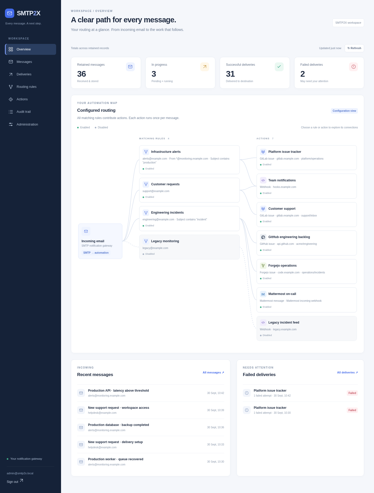
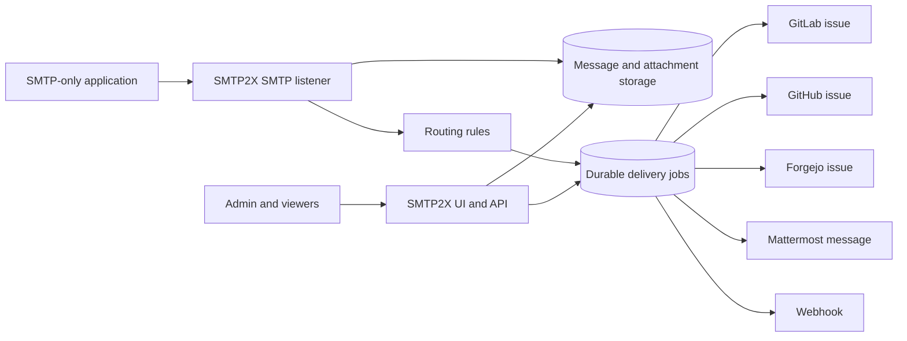
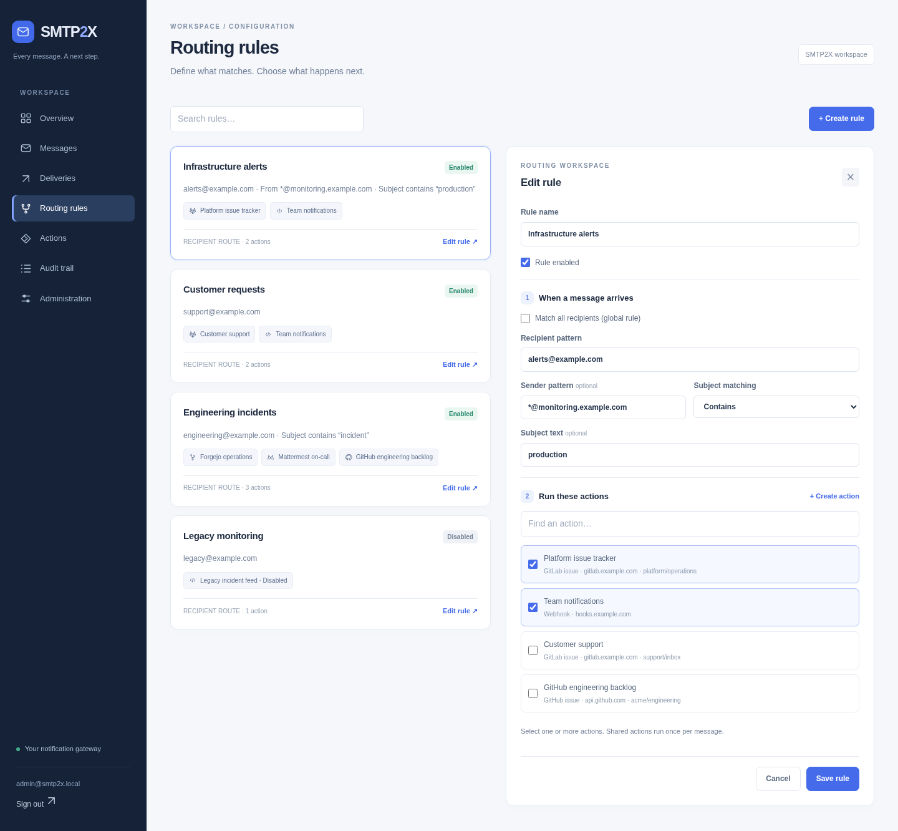

# SMTP2X

[](https://github.com/wenisch-tech/SMTP2X/actions/workflows/ci.yml)
[](https://github.com/wenisch-tech/SMTP2X/releases)
[](https://www.gnu.org/licenses/agpl-3.0.html)
[](https://github.com/wenisch-tech/SMTP2X/pkgs/container/smtp2x)

**Turn SMTP notifications into work.**

SMTP2X is a self-hosted gateway for applications that can only send SMTP notifications, while their users need GitLab, GitHub, or Forgejo issues, Mattermost messages, webhooks, and an auditable delivery history instead of another email inbox. It accepts messages over SMTP, evaluates shared routing rules, stores a durable copy, and delivers each selected action in the background.

The GitLab integration also supports recipient-based assignment: actions can assign issues from SMTP envelope recipients, configured default assignees, or explicit identifier-to-GitLab-user mappings.



## Features

- **SMTP gateway** — accepts SMTP transactions, including multiple `RCPT TO` recipients, parses MIME text/HTML messages and attachments, and never relays mail.
- **Issue trackers** — creates templated issues in GitLab, GitHub, and Forgejo, using the email body as Markdown description and preserving inline images where the forge API supports uploads.
- **Mattermost messages** — posts templated Markdown messages through an incoming webhook, with optional channel, username, and icon overrides.
- **Recipient-based assignees** — combines SMTP recipients with default assignee emails or usernames; resolves project members with normal-user APIs; deduplicates GitLab user IDs; creates the issue unassigned if none resolve.
- **Webhooks** — delivers the body plus attachment MIME metadata and base64 content as JSON, with configurable headers and bearer authentication.
- **Visual routing workspace** — explore SMTP → rules → actions on an interactive dashboard, select actions by name, and create actions directly inside a rule draft.
- **Routing rules** — global and recipient-specific rules can filter on envelope sender and subject. Every matching rule contributes actions; the same action runs once per message.
- **Durable delivery** — SMTP success is returned only after the message and delivery jobs are stored. Failed remote calls retry after 1, 5, 15, and 60 minutes.
- **Message history and audit trail** — inspect received messages, attachments, routing results, delivery attempts, remote issue links, and configuration changes.
- **Built-in and OIDC login** — bootstrap a local administrator or use an OIDC provider such as Keycloak. Mapped OIDC Viewer and Admin roles receive access immediately; unmapped users remain Pending.
- **SMTP controls** — independently configure SMTP authentication, STARTTLS, client CIDR allowlists, message limits, recipient limits, and connection limits.
- **Operations ready** — file-backed H2 for compact installations, PostgreSQL support, Prometheus metrics, Docker, Compose, Helm, health probes, and a GitHub Actions build pipeline.

## How delivery works



SMTP2X is deliberately a single-instance application in this release. A persistent local volume stores raw messages and attachments, while H2 or PostgreSQL stores users, configuration, audit events, and delivery jobs.

## Quick start

SMTP2X creates a local administrator on first start with `admin@smtp2x.local` / `admin`. Set `SMTP2X_ADMIN_PASSWORD` before startup to choose another password. When that environment variable is present, SMTP2X applies it to the bootstrap administrator on **every** startup, so it is an intentional deployment-level password override.

Integration secrets are encrypted with a 32-byte AES key. This includes GitLab, GitHub, and Forgejo tokens, generic webhook bearer tokens, and complete Mattermost incoming-webhook URLs. If `SMTP2X_CRYPTO_KEY` is absent, SMTP2X creates one at `/app/data/encryption.key` and reuses it on later starts. Keep the data volume: losing that file makes existing integration credentials unreadable. Set `SMTP2X_CRYPTO_KEY` when your secret-management policy requires the key to live outside the application volume.

### Docker

Run a standalone instance with persistent application data and SMTP exposed on port 2525:

```bash
docker run --rm \
  --name smtp2x \
  -p 8080:8080 \
  -p 2525:2525 \
  -v smtp2x-data:/app/data \
  -e SMTP2X_SMTP_ENABLED=true \
  ghcr.io/wenisch-tech/smtp2x:latest
```

Open <http://localhost:8080> and sign in as `admin@smtp2x.local` / `admin`. Set `SMTP2X_ADMIN_PASSWORD='change-me-now'` in a real deployment, or change the password in **Administration**. Create an action and a routing rule before pointing an application at `localhost:2525`; SMTP2X correctly rejects messages that match no enabled action.

### Docker Compose

From a source checkout:

```bash
docker compose up --build
```

The Compose volume keeps H2 data, messages, attachments, encrypted integration configuration, and the generated encryption key across restarts.

### Run from source

Prerequisites: JDK 25 and Maven 3.9+.

```bash
mvn spring-boot:run
```

The SMTP listener starts by default on port `2525`. Set `SMTP2X_SMTP_ENABLED=false` when you only want to configure or inspect SMTP2X without accepting SMTP traffic.

## Configure delivery

Open **Routing rules**, choose **Create rule**, and enter the matching conditions. Under **Run these actions**, select actions by name or choose **Create action** to configure an issue tracker, Mattermost message, or webhook without leaving your draft. Newly created actions are selected automatically; **Save rule** connects them. Actions are reusable and remain available if you cancel a rule draft.

You can also create actions on **Actions**, where each action lists the rules that use it. Edit an existing rule to change its conditions, selected actions, or enabled state.



The dashboard’s **Configured routing** view shows the current configuration. Click a rule or action to highlight its connections and inspect its details. Delivery totals and recent activity are shown separately and refresh every 30 seconds while the page is visible; they are not historical per-rule match counts.

Every action includes **Ignore TLS certificate errors** for internal services that use a self-signed or otherwise untrusted certificate. It trusts any server certificate and skips hostname verification for that action only. Leave it disabled unless you control the destination and network; strict TLS validation remains the default.

GitLab and Forgejo issue actions can also schedule permanent deletion with **Auto-delete issue after**. Enter a positive duration such as `5m`, `10h`, or `30d`, or leave it empty to keep issues. Cleanup jobs are stored separately from retained messages, survive restarts, retry temporary provider failures, and appear in the audit history. Deletion uses the same encrypted token and TLS setting captured when the delivery was queued.

The GitLab action needs:

| Setting | Description |
|---|---|
| GitLab base URL | `https://gitlab.com` or the root URL of a self-managed GitLab instance. |
| Project | Numeric project ID or project path such as `platform/alerts`. |
| Access token | A GitLab token authorized to create issues in that project. It is encrypted before storage. |
| Title and description templates | Markdown-capable templates supporting `{{subject}}`, `{{body}}`, `{{from}}`, and `{{recipients}}`. |
| Upload and embed attachments | Uploads files through GitLab's project Markdown-upload API and replaces inline `cid:` image references. |
| Use recipient as assignee | Adds all accepted SMTP envelope recipients to the assignee lookup. It does not use `To` or `Cc` message headers. |
| Default assignees | Adds an email address or exact `@username` for every matching message, whether or not recipient assignment is enabled. |
| Assignee mappings | Optional JSON map from an email address or `@username` to a numeric GitLab user ID, for example `{"oncall@example.com": 42, "@alice": 17}`. |
| Auto-delete issue after | Optional duration such as `5m`, `10h`, or `30d`. The token must be allowed to delete the created issue. |

SMTP2X uses mappings first, then searches the configured project's visible members through `GET /projects/:id/members/all`. An `@username` is matched exactly. For email addresses, an exact returned email is preferred; when GitLab keeps the email private, SMTP2X accepts the result only if GitLab's project-member query returns one unambiguous active member. Recipient-derived and default assignees are combined and deduplicated. GitLab Premium and Ultimate support the resulting `assignee_ids` list. If no configured identifier resolves to an assignable GitLab user, SMTP2X still creates the issue without an assignee and records a delivery warning.

The lookup uses APIs available to a normal authenticated user and does not query GitLab administrator endpoints. If GitLab cannot uniquely resolve a private email for the project, use an exact `@username` or an explicit numeric mapping. The **Validate assignees** button previews mappings and lookups without creating an issue.

### A typical route

1. Create a recipient rule for `alerts@example.com`. Under **Run these actions**, choose **Create action**.
2. Configure a GitLab action for `platform/alerts`, with `support@example.com` as a default assignee and **Use recipient as assignee** enabled. Create the action, then save the rule.
3. Configure your existing application with SMTP host `smtp2x.example.com`, port `2525`, and recipient `alerts@example.com`.
4. A message addressed to `alice@example.com` and `alerts@example.com` is accepted once. The resulting GitLab issue is assigned to Alice when resolvable, plus Support when resolvable.

## Configure GitHub Issues

Choose **GitHub issue** when creating an action. Configure:

| Setting | Description |
|---|---|
| GitHub API URL | Keep `https://api.github.com` for GitHub.com. For GitHub Enterprise Server, enter its REST API root, normally `https://github.example.com/api/v3`. |
| Repository | Repository in `owner/repository` form. |
| Access token | Fine-grained personal, GitHub App user, or GitHub App installation token with repository **Issues: write** permission. It is encrypted before storage. |
| Title and body templates | Markdown-capable templates supporting `{{subject}}`, `{{body}}`, `{{from}}`, and `{{recipients}}`. |
| Labels | Label names, one per line. The labels must already exist in the repository. |
| Assignees | GitHub usernames, one per line. The token must be allowed to assign them. |

SMTP2X calls GitHub's versioned `POST /repos/{owner}/{repo}/issues` API. A rejected configuration is recorded as a permanent delivery failure; rate limits and server failures use the normal retry schedule. See [GitHub's create-issue API documentation](https://docs.github.com/en/rest/issues/issues#create-an-issue).

GitHub's issue REST API has no supported file-upload field. SMTP2X therefore adds an attachment note to the issue body and records a delivery warning; it does not commit mail attachments into the repository.

## Configure Forgejo Issues

Choose **Forgejo issue** when creating an action. Configure:

| Setting | Description |
|---|---|
| Forgejo base URL | Root URL of the Forgejo instance, such as `https://code.example.com`. |
| Repository | Repository in `owner/repository` form. |
| Access token | Forgejo access token with permission to write issues in the selected repository. It is encrypted before storage. |
| Title and body templates | Markdown-capable templates supporting `{{subject}}`, `{{body}}`, `{{from}}`, and `{{recipients}}`. |
| Upload and embed attachments | Attaches files to the created issue and updates inline `cid:` image references to their Forgejo download URLs. |
| Label IDs | Numeric Forgejo label IDs, one per line. |
| Assignees | Forgejo usernames, one per line. |
| Auto-delete issue after | Optional duration such as `5m`, `10h`, or `30d`. The token must be allowed to delete the created issue. |

SMTP2X calls `POST /api/v1/repos/{owner}/{repo}/issues` and authenticates through the HTTP `Authorization` header. Forgejo exposes the instance-specific OpenAPI reference under `/api/swagger` when Swagger is enabled. See the [Forgejo API guide](https://forgejo.org/docs/latest/user/api/) for authentication and instance API documentation.

## Configure generic webhooks

Generic webhooks receive an `application/json` payload with `version: "2"`. Its `text` field contains the preferred plain-text email body, or Markdown converted from HTML when no plain alternative exists. Each `attachments` item contains `filename`, `contentType`, `contentId`, `disposition`, `inline`, `size`, and `contentBase64`; consumers can use the content ID to resolve `cid:` references in the text. Custom payloads configured through the API continue to replace this default payload.

## Configure Mattermost Messages

Create an incoming webhook in Mattermost, then choose **Mattermost message** in SMTP2X and paste the generated URL. The full URL contains the webhook credential and is encrypted before storage; SMTP2X never places it in delivery links or dashboard responses.

The message template supports Mattermost Markdown and `{{subject}}`, `{{body}}`, `{{from}}`, and `{{recipients}}`. Channel, username, and icon URL overrides are optional and require the corresponding override settings to be enabled by the Mattermost administrator. See [Mattermost incoming webhooks](https://developers.mattermost.com/integrate/webhooks/incoming/) for server setup.

## SMTP configuration

The SMTP server is configured through environment variables. Changes to port or TLS material require an application restart; routing rules and SMTP credentials take effect from the database without a restart.

| Variable | Default | Description |
|---|---:|---|
| `SMTP2X_SMTP_ENABLED` | `true` | Starts the SMTP listener. |
| `SMTP2X_SMTP_PORT` | `2525` | Listener port. Use a load balancer or host port mapping for port 25. |
| `SMTP2X_SMTP_AUTHENTICATION` | `DISABLED` | `DISABLED`, `OPTIONAL`, or `REQUIRED`. SMTP credentials are separate from UI accounts. |
| `SMTP2X_SMTP_USERNAME` | empty | Initial dedicated SMTP account username. Set together with `SMTP2X_SMTP_PASSWORD`. |
| `SMTP2X_SMTP_PASSWORD` | empty | Initial dedicated SMTP account password. It is stored as a password hash. |
| `SMTP2X_SMTP_STARTTLS` | `DISABLED` | `DISABLED`, `OPTIONAL`, or `REQUIRED`. |
| `SMTP2X_SMTP_TLS_KEYSTORE_PATH` | — | PKCS#12 keystore path for STARTTLS. Mount it into the container. |
| `SMTP2X_SMTP_TLS_KEYSTORE_PASSWORD` | — | Password for the STARTTLS PKCS#12 keystore. |
| `SMTP2X_SMTP_ALLOWED_CIDRS` | empty | Comma-separated IPv4 or IPv6 CIDRs, for example `10.0.0.0/8,2001:db8::/32`. |
| `SMTP2X_SMTP_MAX_MESSAGE_BYTES` | `10485760` | Maximum accepted message size, 10 MiB by default. |
| `SMTP2X_SMTP_MAX_RECIPIENTS` | `100` | Maximum recipients per SMTP transaction. |
| `SMTP2X_SMTP_MAX_CONNECTIONS` | `50` | Maximum concurrent SMTP connections. |

With `SMTP2X_SMTP_AUTHENTICATION=DISABLED`, SMTP2X does not advertise the `AUTH` capability and accepts anonymous SMTP transactions. `OPTIONAL` advertises `AUTH` while still allowing anonymous delivery; only `REQUIRED` rejects unauthenticated senders.

When STARTTLS is `OPTIONAL` or `REQUIRED`, provide both keystore variables. SMTP2X refuses startup for `REQUIRED` without usable certificate material. A client allowlist applies to anonymous and authenticated clients, so ensure the network address survives any TCP proxy or load balancer.

To require SMTP authentication from the first start, supply a dedicated application account:

```bash
SMTP2X_SMTP_AUTHENTICATION=REQUIRED \
SMTP2X_SMTP_USERNAME=monitoring-app \
SMTP2X_SMTP_PASSWORD='a-long-random-password' \
docker compose up --build
```

The username and password must be supplied together. SMTP2X creates this account only when the username does not already exist, so changing the environment password later does not overwrite a deployed credential or invalidate active senders.

## Authentication and OIDC

Local login always remains available for the bootstrap administrator. New OIDC users are provisioned as `PENDING` unless role mapping grants `VIEWER` or `ADMIN`; pending users can see only the access-pending page until an administrator changes their role.

Set `SMTP2X_SECURITY_OIDC_ENABLED=true` and configure Spring Security’s standard OIDC client registration. The complete Keycloak registration can be supplied through environment variables:

```bash
SMTP2X_SECURITY_OIDC_ENABLED=true
SMTP2X_SECURITY_OIDC_ROLE_MAPPING_ENABLED=true
OIDC_IGNORE_TLS=false
SPRING_SECURITY_OAUTH2_CLIENT_REGISTRATION_KEYCLOAK_CLIENT_ID=smtp2x
SPRING_SECURITY_OAUTH2_CLIENT_REGISTRATION_KEYCLOAK_CLIENT_SECRET=change-me
SPRING_SECURITY_OAUTH2_CLIENT_REGISTRATION_KEYCLOAK_SCOPE=openid,profile,email
SPRING_SECURITY_OAUTH2_CLIENT_PROVIDER_KEYCLOAK_ISSUER_URI=https://auth.example.com/realms/smtp2x
```

Configure this callback at the provider:

```text
https://smtp2x.example.com/login/oauth2/code/keycloak
```

SMTP2X identifies a user from the verified ID token’s `email` claim, falling back to `preferred_username`. It does not call the UserInfo endpoint. Set `SMTP2X_SECURITY_OIDC_ROLE_MAPPING_ENABLED=true` to synchronize Keycloak roles on every login:

| OIDC role | SMTP2X access |
|---|---|
| `SMTP2X_Admin` or `ROLE_SMTP2X_ADMIN` | Admin |
| `SMTP2X_Viewer` or `ROLE_SMTP2X_VIEWER` | Viewer |
| Neither | Pending |

Role names are matched case-insensitively. SMTP2X reads collection-valued and single-string roles from `roles`, `realm_access.roles`, and each `resource_access.*.roles` claim. If both mapped roles are present, Admin takes precedence.

For temporary troubleshooting with a private or self-signed issuer certificate, set `OIDC_IGNORE_TLS=true`. This disables certificate and hostname verification for OIDC discovery, token exchange, and JWK retrieval. Install the issuer CA in the container trust store for production deployments instead.

Behind an HTTPS reverse proxy or Kubernetes ingress, retain `X-Forwarded-Proto`, `X-Forwarded-Host`, and `X-Forwarded-Port`. SMTP2X uses Spring’s forwarded-header support so the OIDC callback uses the public HTTPS URL.

## Data, retention, and PostgreSQL

Standalone deployments use file-backed H2 at `/app/data` and store raw messages plus attachments in the same data directory. Back up that directory together with the database; messages cannot be reconstructed from delivery records alone.

Message content defaults to a 30-day retention period and audit history to one year. Configure them with:

| Variable | Default |
|---|---:|
| `SMTP2X_RETENTION_CONTENT_DAYS` | `30` |
| `SMTP2X_RETENTION_AUDIT_DAYS` | `365` |

For PostgreSQL, activate the `postgres` profile and use a persistent message volume:

```bash
docker run --rm \
  -p 8080:8080 -p 2525:2525 \
  -v smtp2x-data:/app/data \
  -e SMTP2X_ADMIN_PASSWORD='change-me-now' \
  -e SPRING_PROFILES_ACTIVE=postgres \
  -e SPRING_DATASOURCE_URL='jdbc:postgresql://postgres.example:5432/smtp2x' \
  -e SPRING_DATASOURCE_USERNAME='smtp2x' \
  -e SPRING_DATASOURCE_PASSWORD='database-password' \
  ghcr.io/wenisch-tech/smtp2x:latest
```

Flyway creates and upgrades the schema automatically.

## Kubernetes with Helm

The supplied chart creates separate HTTP and SMTP Services, a persistent volume claim, and HTTP health probes. SMTP2X must run as **one replica** in this release because attachment storage is local to the pod.

```bash
helm install smtp2x oci://ghcr.io/wenisch-tech/helm-charts/smtp2x \
  --namespace smtp2x --create-namespace \
  --set-string secrets.SMTP2X_ADMIN_PASSWORD='change-me-now' \
  --set env.SMTP2X_SMTP_ENABLED=true
```

Each main-branch release publishes this chart to `oci://ghcr.io/wenisch-tech/helm-charts/smtp2x`. Use `./charts/smtp2x` in the commands above when developing from a source checkout.

For PostgreSQL, add the profile and data-source values:

```bash
helm upgrade --install smtp2x oci://ghcr.io/wenisch-tech/helm-charts/smtp2x \
  --namespace smtp2x --create-namespace \
  --set-string secrets.SMTP2X_ADMIN_PASSWORD='change-me-now' \
  --set-string secrets.SPRING_DATASOURCE_PASSWORD='database-password' \
  --set env.SPRING_PROFILES_ACTIVE=postgres \
  --set env.SPRING_DATASOURCE_URL='jdbc:postgresql://postgres:5432/smtp2x' \
  --set env.SPRING_DATASOURCE_USERNAME=smtp2x
```

The SMTP Service defaults to `LoadBalancer` and the HTTP Service defaults to `ClusterIP`. The chart includes an optional HTTP ingress with configurable hosts, paths, annotations, ingress class, and TLS. See [`charts/smtp2x/README.md`](charts/smtp2x/README.md) for ingress and environment-based OIDC examples. Verify that any SMTP load balancer or TCP ingress preserves the client address before enforcing SMTP CIDR allowlists.

## Releases and verification

A successful main-branch build updates [CHANGELOG.md](CHANGELOG.md) from conventional commits, publishes the container and OCI Helm chart, attaches CycloneDX SBOMs and signed release artifacts, and records GitHub build provenance. The release tag is created only after verification, container publication, chart publication, signing, and attestation have succeeded.

Use the immutable image digest shown in the GitHub release to verify its keyless Cosign signature:

```bash
cosign verify ghcr.io/wenisch-tech/smtp2x@sha256:<digest> \
  --certificate-identity-regexp="https://github.com/wenisch-tech/SMTP2X" \
  --certificate-oidc-issuer="https://token.actions.githubusercontent.com"
```

Verify the GitHub build provenance for the same digest:

```bash
gh attestation verify oci://ghcr.io/wenisch-tech/smtp2x@sha256:<digest> \
  --repo wenisch-tech/SMTP2X
```

Download `smtp2x-<version>.tgz` and its matching `.cosign.bundle` from the GitHub release, then verify the packaged Helm chart:

```bash
cosign verify-blob smtp2x-<version>.tgz \
  --bundle smtp2x-<version>.tgz.cosign.bundle \
  --certificate-identity-regexp="https://github.com/wenisch-tech/SMTP2X" \
  --certificate-oidc-issuer="https://token.actions.githubusercontent.com"
```

The versioned JAR and its bundle are verified with the same command:

```bash
cosign verify-blob smtp2x-<version>.jar \
  --bundle smtp2x-<version>.jar.cosign.bundle \
  --certificate-identity-regexp="https://github.com/wenisch-tech/SMTP2X" \
  --certificate-oidc-issuer="https://token.actions.githubusercontent.com"
```

## Monitoring

SMTP2X publishes Prometheus metrics at `/actuator/prometheus`. The endpoint is intentionally available without application authentication so Prometheus can scrape it; metric labels contain only bounded action types, statuses, outcomes, and rejection reasons. Liveness is available at `/actuator/health/liveness` and readiness at `/actuator/health/readiness`.

The Helm chart enables standard scrape annotations on the HTTP Service by default:

```yaml
metrics:
  path: /actuator/prometheus
  serviceAnnotations:
    enabled: true
```

For Docker or another static target, add SMTP2X to `prometheus.yml`:

```yaml
scrape_configs:
  - job_name: smtp2x
    metrics_path: /actuator/prometheus
    static_configs:
      - targets: ["smtp2x:8080"]
```

Application metrics include:

| Metric | Description |
|---|---|
| `smtp2x_mail_received_total` | Messages durably accepted over SMTP |
| `smtp2x_mail_rejected_total{reason}` | Rejected messages by bounded reason |
| `smtp2x_mail_size_bytes_*` | Accepted message size summary |
| `smtp2x_mail_attachments_total` | Attachments in accepted messages |
| `smtp2x_action_triggered_total{action_type}` | Delivery jobs created by action type |
| `smtp2x_action_delivery_attempts_total{action_type,outcome}` | Delivery attempts by action type and outcome |
| `smtp2x_action_delivery_duration_seconds_*` | Delivery duration by action type and outcome |
| `smtp2x_delivery_jobs{status}` | Current persisted delivery jobs by status |
| `smtp2x_cleanup_attempts_total{action_type,outcome}` | External cleanup attempts by outcome |
| `smtp2x_cleanup_jobs{status}` | Current persisted cleanup jobs by status |

Import [`docs/smtp2x-grafana-dashboard.json`](docs/smtp2x-grafana-dashboard.json) through **Dashboards → New → Import** in Grafana. Choose the Prometheus datasource from the selector at the top of the imported dashboard, then optionally narrow the view by `job` and `instance`.

## API

- OpenAPI document: `/v3/api-docs`
- Swagger UI: `/swagger-ui.html`

The UI and `/api/v1` require an authenticated Viewer or Admin session. Administrators manage actions, rules, users, role grants, retries, and cancellations. Viewer accounts can inspect messages, deliveries, attachments, and audit history.

## Development

```bash
mvn verify
```

The test suite covers GitLab assignee resolution; GitHub, Forgejo, Mattermost, and generic-webhook payloads; strict and explicitly ignored TLS certificate validation; encrypted credential handling; routing configuration; dashboard summaries; and access control. The GitHub Actions workflow verifies Maven tests, builds the container, runs Trivy scanning, and renders the Helm chart when Helm is available.

### Browser checks and documentation screenshots

Node.js and the Playwright Chromium browser are needed only for development tooling; the application still uses Thymeleaf and vanilla JavaScript.

```bash
npm ci
npx playwright install chromium
npm run test:ui
# Regenerate just the two README images:
npm run screenshots
```

These commands compile the test fixture server and start it on `127.0.0.1:18080` with a temporary in-memory H2 database, fictional routes and activity, and SMTP disabled. The server is shut down afterwards. No demo mode is included in the production application, and fixture delivery jobs cannot make external requests. Screenshots are written to `docs/smtp2x-dashboard.png` and `docs/smtp2x-rules.png`.

## License

SMTP2X is licensed under [AGPL-3.0](https://www.gnu.org/licenses/agpl-3.0.html). Its Spring Boot, OIDC, Docker, Helm, and pipeline conventions are closely based on [ContextCrate](https://github.com/wenisch-tech/ContextCrate).
