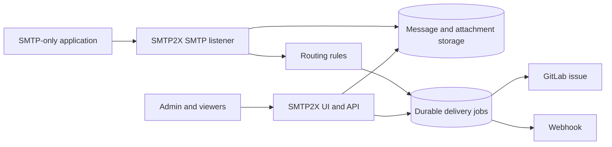

# SMTP2X

[](https://github.com/wenisch-tech/SMTP2X/actions/workflows/ci.yml)
[](https://github.com/wenisch-tech/SMTP2X/releases)
[](https://www.gnu.org/licenses/agpl-3.0.html)
[](https://github.com/wenisch-tech/SMTP2X/pkgs/container/smtp2x)

**Turn SMTP notifications into work.**

SMTP2X is a self-hosted gateway for applications that can only send SMTP notifications, while their users need GitLab issues, webhooks, and an auditable delivery history instead of another email inbox. It accepts messages over SMTP, evaluates shared routing rules, stores a durable copy, and delivers each selected action in the background.

Its first-class integration is **GitLab issue creation**: actions can assign issues from SMTP envelope recipients, configured default assignees, or explicit email-to-GitLab-user mappings.

## Features

- **SMTP gateway** — accepts SMTP transactions, including multiple `RCPT TO` recipients, parses MIME text/HTML messages and attachments, and never relays mail.
- **GitLab issues first** — creates issues in GitLab.com or self-managed GitLab with a configurable project, title and description, labels, confidentiality, assignees, and optional attachment uploads.
- **Recipient-based assignees** — combines SMTP recipients with default assignee email addresses; resolves mappings before exact GitLab email lookup; deduplicates GitLab user IDs; creates the issue unassigned if none resolve.
- **Webhooks** — delivers a JSON representation of the accepted message to HTTP endpoints, with configurable headers and bearer authentication.
- **Routing rules** — global and recipient-specific rules can filter on envelope sender and subject. Every matching rule contributes actions; the same action runs once per message.
- **Durable delivery** — SMTP success is returned only after the message and delivery jobs are stored. Failed remote calls retry after 1, 5, 15, and 60 minutes.
- **Message history and audit trail** — inspect received messages, attachments, routing results, delivery attempts, remote issue links, and configuration changes.
- **Built-in and OIDC login** — bootstrap a local administrator or use an OIDC provider such as Keycloak. OIDC users start as Pending until an administrator grants Viewer or Admin access.
- **SMTP controls** — independently configure SMTP authentication, STARTTLS, client CIDR allowlists, message limits, recipient limits, and connection limits.
- **Operations ready** — file-backed H2 for compact installations, PostgreSQL support, Prometheus metrics, Docker, Compose, Helm, health probes, and a GitHub Actions build pipeline.

## How delivery works



SMTP2X is deliberately a single-instance application in this release. A persistent local volume stores raw messages and attachments, while H2 or PostgreSQL stores users, configuration, audit events, and delivery jobs.

## Quick start

SMTP2X requires `SMTP2X_ADMIN_PASSWORD` on its first start to create the initial local administrator.

Integration secrets are encrypted with a 32-byte AES key. If `SMTP2X_CRYPTO_KEY` is absent, SMTP2X creates one at `/app/data/encryption.key` and reuses it on later starts. Keep the data volume: losing that file makes existing GitLab and webhook credentials unreadable. Set `SMTP2X_CRYPTO_KEY` when your secret-management policy requires the key to live outside the application volume.

### Docker

Run a standalone instance with persistent application data and SMTP exposed on port 2525:

```bash
docker run --rm \
  --name smtp2x \
  -p 8080:8080 \
  -p 2525:2525 \
  -v smtp2x-data:/app/data \
  -e SMTP2X_ADMIN_PASSWORD='change-me-now' \
  -e SMTP2X_SMTP_ENABLED=true \
  ghcr.io/wenisch-tech/smtp2x:latest
```

Open <http://localhost:8080> and sign in as `admin@smtp2x.local` with the password you supplied. Create a GitLab action and a routing rule before pointing an application at `localhost:2525`; SMTP2X correctly rejects messages that match no enabled action.

### Docker Compose

From a source checkout:

```bash
export SMTP2X_ADMIN_PASSWORD='change-me-now'
docker compose up --build
```

The Compose volume keeps H2 data, messages, attachments, encrypted integration configuration, and the generated encryption key across restarts.

### Run from source

Prerequisites: JDK 25 and Maven 3.9+.

```bash
export SMTP2X_ADMIN_PASSWORD='change-me-now'
mvn spring-boot:run
```

The SMTP listener starts by default on port `2525`. Set `SMTP2X_SMTP_ENABLED=false` when you only want to configure or inspect SMTP2X without accepting SMTP traffic.

## Configure GitLab delivery

Create a **GitLab issue** action from **Actions** in the UI, then create a global or recipient-specific rule that selects it.

The GitLab action needs:

| Setting | Description |
|---|---|
| GitLab base URL | `https://gitlab.com` or the root URL of a self-managed GitLab instance. |
| Project | Numeric project ID or project path such as `platform/alerts`. |
| Access token | A GitLab token authorized to create issues in that project. It is encrypted before storage. |
| Use recipient as assignee | Adds all accepted SMTP envelope recipients to the assignee lookup. It does not use `To` or `Cc` message headers. |
| Default assignee emails | Adds these addresses for every matching message, whether or not recipient assignment is enabled. |
| Email mappings | Optional JSON map from email address to numeric GitLab user ID, for example `{"oncall@example.com": 42}`. |

SMTP2X uses mappings first, then performs an exact public-email lookup. Recipient-derived and default assignees are combined and deduplicated. GitLab Premium and Ultimate support the resulting `assignee_ids` list. If no configured address resolves to an assignable GitLab user, SMTP2X still creates the issue without an assignee and records a delivery warning.

Private GitLab email addresses are not generally visible to ordinary project tokens. Use an explicit mapping when a public-email lookup cannot find a user. The **Validate assignees** button previews mappings and lookups without creating an issue.

### A typical route

1. Create a GitLab action for `platform/alerts`, with `support@example.com` as a default assignee and **Use recipient as assignee** enabled.
2. Create a recipient rule for `alerts@example.com` and attach that action.
3. Configure your existing application with SMTP host `smtp2x.example.com`, port `2525`, and recipient `alerts@example.com`.
4. A message addressed to `alice@example.com` and `alerts@example.com` is accepted once. The resulting GitLab issue is assigned to Alice when resolvable, plus Support when resolvable.

## SMTP configuration

The SMTP server is configured through environment variables. Changes to port or TLS material require an application restart; routing rules and SMTP credentials take effect from the database without a restart.

| Variable | Default | Description |
|---|---:|---|
| `SMTP2X_SMTP_ENABLED` | `true` | Starts the SMTP listener. |
| `SMTP2X_SMTP_PORT` | `2525` | Listener port. Use a load balancer or host port mapping for port 25. |
| `SMTP2X_SMTP_AUTHENTICATION` | `DISABLED` | `DISABLED`, `OPTIONAL`, or `REQUIRED`. SMTP credentials are separate from UI accounts. |
| `SMTP2X_SMTP_STARTTLS` | `DISABLED` | `DISABLED`, `OPTIONAL`, or `REQUIRED`. |
| `SMTP2X_SMTP_TLS_KEYSTORE_PATH` | — | PKCS#12 keystore path for STARTTLS. Mount it into the container. |
| `SMTP2X_SMTP_TLS_KEYSTORE_PASSWORD` | — | Password for the STARTTLS PKCS#12 keystore. |
| `SMTP2X_SMTP_ALLOWED_CIDRS` | empty | Comma-separated IPv4 or IPv6 CIDRs, for example `10.0.0.0/8,2001:db8::/32`. |
| `SMTP2X_SMTP_MAX_MESSAGE_BYTES` | `10485760` | Maximum accepted message size, 10 MiB by default. |
| `SMTP2X_SMTP_MAX_RECIPIENTS` | `100` | Maximum recipients per SMTP transaction. |
| `SMTP2X_SMTP_MAX_CONNECTIONS` | `50` | Maximum concurrent SMTP connections. |

When STARTTLS is `OPTIONAL` or `REQUIRED`, provide both keystore variables. SMTP2X refuses startup for `REQUIRED` without usable certificate material. A client allowlist applies to anonymous and authenticated clients, so ensure the network address survives any TCP proxy or load balancer.

## Authentication and OIDC

Local login always remains available for the bootstrap administrator. New OIDC users are provisioned as `PENDING`; they can see only the access-pending page until an administrator changes their role to `VIEWER` or `ADMIN`.

Set `SMTP2X_SECURITY_OIDC_ENABLED=true` and configure Spring Security’s standard OIDC client registration. A Keycloak example:

```yaml
spring:
  security:
    oauth2:
      client:
        registration:
          keycloak:
            client-id: smtp2x
            client-secret: ${SMTP2X_OIDC_CLIENT_SECRET}
            scope: openid,profile,email
        provider:
          keycloak:
            issuer-uri: https://auth.example.com/realms/smtp2x
```

Configure this callback at the provider:

```text
https://smtp2x.example.com/login/oauth2/code/keycloak
```

SMTP2X identifies a user from the verified ID token’s `email` claim, falling back to `preferred_username`. It does not call the UserInfo endpoint. Set `SMTP2X_SECURITY_OIDC_ROLE_MAPPING_ENABLED=true` to synchronize Keycloak roles on every login:

| OIDC role | SMTP2X access |
|---|---|
| `SMTP2X_Admin` | Admin |
| `SMTP2X_Viewer` | Viewer |
| Neither | Pending |

Behind an HTTPS reverse proxy or Kubernetes ingress, retain `X-Forwarded-Proto`, `X-Forwarded-Host`, and `X-Forwarded-Port`. SMTP2X uses Spring’s forwarded-header support so the OIDC callback uses the public HTTPS URL.

## Data, retention, and PostgreSQL

Standalone deployments use file-backed H2 at `/app/data` and store raw messages plus attachments in the same data directory. Back up that directory together with the database; messages cannot be reconstructed from delivery records alone.

Message content defaults to a 30-day retention period and audit history to one year. Configure them with:

| Variable | Default |
|---|---:|
| `SMTP2X_RETENTION_CONTENT_DAYS` | `30` |
| `SMTP2X_RETENTION_AUDIT_DAYS` | `365` |

For PostgreSQL, activate the `postgres` profile and use a persistent message volume:

```bash
docker run --rm \
  -p 8080:8080 -p 2525:2525 \
  -v smtp2x-data:/app/data \
  -e SMTP2X_ADMIN_PASSWORD='change-me-now' \
  -e SPRING_PROFILES_ACTIVE=postgres \
  -e SPRING_DATASOURCE_URL='jdbc:postgresql://postgres.example:5432/smtp2x' \
  -e SPRING_DATASOURCE_USERNAME='smtp2x' \
  -e SPRING_DATASOURCE_PASSWORD='database-password' \
  ghcr.io/wenisch-tech/smtp2x:latest
```

Flyway creates and upgrades the schema automatically.

## Kubernetes with Helm

The supplied chart creates separate HTTP and SMTP Services, a persistent volume claim, and HTTP health probes. SMTP2X must run as **one replica** in this release because attachment storage is local to the pod.

```bash
helm install smtp2x ./charts/smtp2x \
  --namespace smtp2x --create-namespace \
  --set-string secrets.SMTP2X_ADMIN_PASSWORD='change-me-now' \
  --set env.SMTP2X_SMTP_ENABLED=true
```

For PostgreSQL, add the profile and data-source values:

```bash
helm upgrade --install smtp2x ./charts/smtp2x \
  --namespace smtp2x --create-namespace \
  --set-string secrets.SMTP2X_ADMIN_PASSWORD='change-me-now' \
  --set-string secrets.SPRING_DATASOURCE_PASSWORD='database-password' \
  --set env.SPRING_PROFILES_ACTIVE=postgres \
  --set env.SPRING_DATASOURCE_URL='jdbc:postgresql://postgres:5432/smtp2x' \
  --set env.SPRING_DATASOURCE_USERNAME=smtp2x
```

The SMTP Service defaults to `LoadBalancer` and the HTTP Service defaults to `ClusterIP`. Configure your ingress controller or reverse proxy for HTTP, and verify that its TCP configuration preserves the client address before enforcing SMTP CIDR allowlists.

## Observability and API

- Liveness: `/actuator/health/liveness`
- Readiness: `/actuator/health/readiness`
- Prometheus metrics: `/actuator/prometheus`
- OpenAPI document: `/v3/api-docs`
- Swagger UI: `/swagger-ui.html`

The UI and `/api/v1` require an authenticated Viewer or Admin session. Administrators manage actions, rules, users, role grants, retries, and cancellations. Viewer accounts can inspect messages, deliveries, attachments, and audit history.

## Development

```bash
mvn verify
```

The test suite covers recipient-plus-default GitLab assignee resolution and routing. The GitHub Actions workflow verifies Maven tests, builds the container, runs Trivy scanning, and renders the Helm chart when Helm is available.

## License

SMTP2X is licensed under [AGPL-3.0](https://www.gnu.org/licenses/agpl-3.0.html). Its Spring Boot, OIDC, Docker, Helm, and pipeline conventions are closely based on [ContextCrate](https://github.com/wenisch-tech/ContextCrate).
